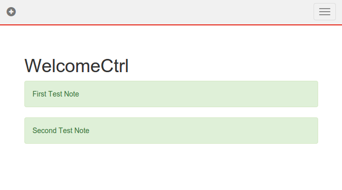

## Creating frontend application for fhirplace

---

[node.js](http://nodejs.org/) is used for development.
Preferred way to install node is [nvm](https://github.com/creationix/nvm#installation)
(node version manager).

When you have installed node,
clone example repository [fhirbase-empty-plugin]()

```
git clone https://github.com/fhirbase/fhirplace-empty-plugin [APP-NAME]
```

This is preconfigured application, which consist of:

* fhir.js
* angularjs
* coffee
* less
* npm
* bower
* webpack

All util scripts are described at package.json


You can publish it on any installation of
[fhirplace]() server.

```sh
npm run-script fhir
```

For development start [webpack dev server](http://webpack.github.io/docs/webpack-dev-server.html) and
open browser on http://localhost:8080:

```sh
npm start
```

## Creating frontend application for fhir server

To illustrate we use [fhirplace](http://fhirplace.health-samurai.io/)
generic implementation of [fhir server](http://www.hl7.org/implement/standards/fhir/http.html)
and [fhir.js](https://github.com/FHIR/fhir.js) client library.

Start with [fhirplace-empty-plugin](https://github.com/fhirbase/fhirplace-empty-plugin) sample application

```
git clone https://github.com/fhirbase/fhirplace-empty-plugin sample
```

Take a look at new application structure

```sh
| ~ | cd sample 
| sample | master | tree   
.
├── bower.json
├── fhir.json
├── package.json
├── publish
├── src
│   ├── coffee
│   │   ├── app.coffee
│   ├── fhir.json
│   ├── index.html
│   ├── less
│   │   └── app.less
│   └── views
│       ├── index.html
└── webpack.config.js

5 directories, 22 files
```

```sh
less package.json

{
  "name": "fhirbase-empty-plugin",
  "version": "0.0.0",
  "dependencies": {},
  "devDependencies": {
    "fhirbase.js": "0.0.3",
    "bower": "latest",
    "coffee": "latest",
    "coffee-loader": "latest",
    "css-loader": "latest",
    "html-loader": "latest",
    "less-loader": "latest",
    "file-loader": "latest",
    "ng-cache-loader": "latest",
    "style-loader": "latest",
    "webpack": "latest",
    "extract-text-webpack-plugin": "latest",
    "webpack-dev-server": "latest"
  },
  "engines": {
    "node": ">=0.10.0"
  },
  "scripts": {
    "install": "bower prune && bower install",
    "start": "bower prune && bower install && webpack-dev-server --progress --colors",
    "build": "npm install && rm -rf dist && webpack --progress --colors"
  }
}
```

we use [node.js]() as development runtime
install node.js
[bower]() to manage dependencies

add `"fhir.js": "0.0.5"` to bower file
this will add fhir.js client library
entry point to application is `src/index.html`
<script src="app.js"></script> will add all javascript produced to application

    "start": "bower prune && bower install && webpack-dev-server --port 11166 --progress --colors"

then run
```sh
npm install
```

```sh
npm start
```
At some point you will see:
```sh
> bower prune && bower install && webpack-dev-server --port 11166 --progress --colors
```
Than means you can go to localhost:11166 and see result


* describe project structure with each file description
* links to npm webpack bower angular twitter bootstrap
* describe fhir.js library
* add new page with link to 


src/coffee/app.coffee
```
require('../../bower_components/fhir.js/dist/ngFhir.js')

app.config ($fhirProvider)->
  $fhirProvider.baseUrl = 'http://try-fhirplace.hospital-systems.com'

app.controller 'WelcomeCtrl', ($scope, $fhir)->
  $scope.header = "WelcomeCtrl"
  $fhir.search(type: 'Alert', query: {})
    .success (data)->
      $scope.data = data
```

src/coffee/module.coffee

```
'ng-fhir'
```


src/views/index.html

```
<div class="alert alert-success" ng-repeat="entry in data.entry">
  {{entry.content.note}}
</div>
```




now you ar ready to publish your application, modify


manifest file

src/fhir.json

```
{
  "name": "test",
  "title": "Sample Application",
   "version": "0.0.1",
  "description": "Show Alert Resources"
}
```

publish

```
APP='sample'
```

run
```
./publish

{"url":"\/sample\/index.html","name":"test","title":"Sample Application","version":"0.0.1","description":"Show Alert Resources"}
```
navigate to

(Sample Application) [http://fhirplace.health-samurai.io/sample/index.html#/]
and see you application 

full available at [github](https://github.com/fhirbase/sample-app)