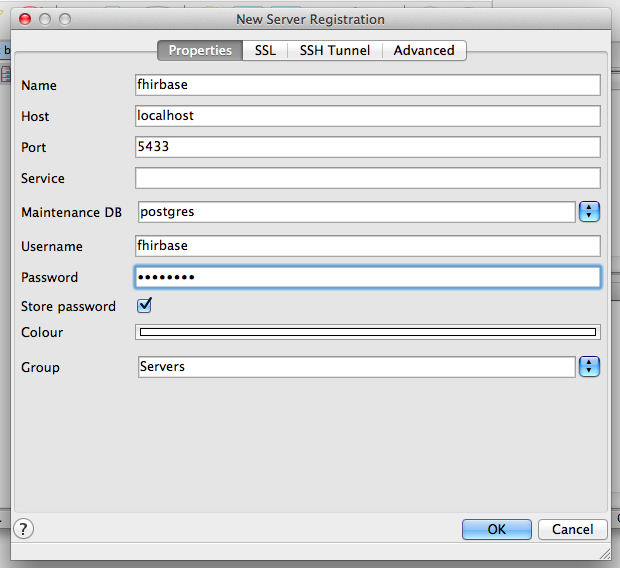
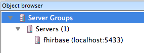
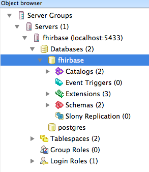
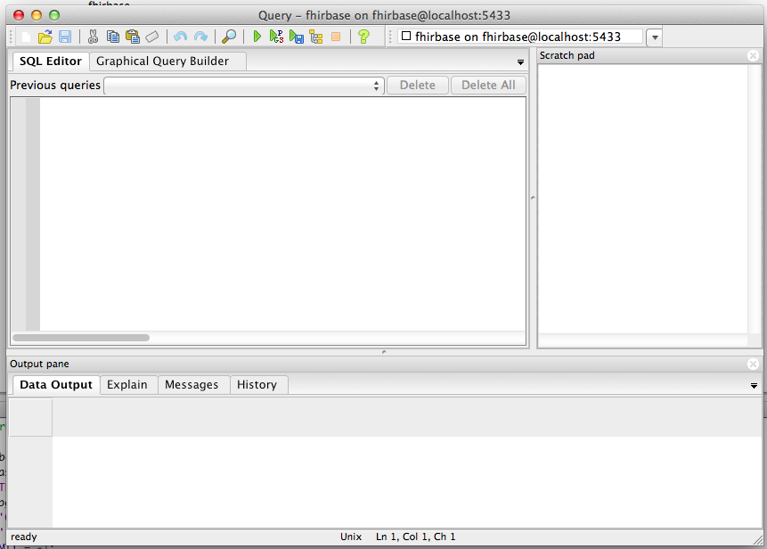
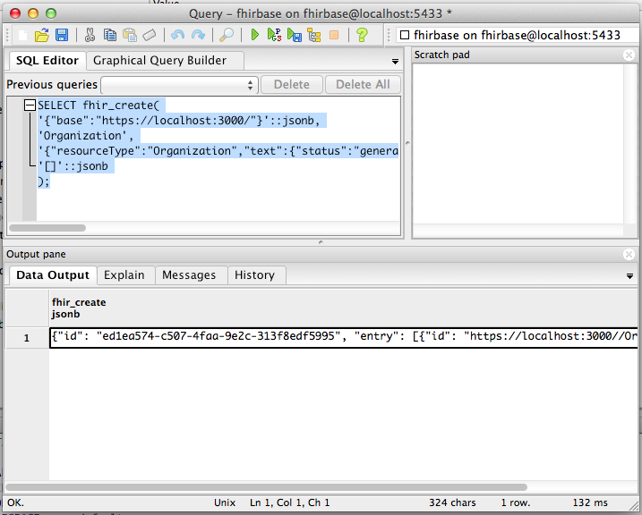
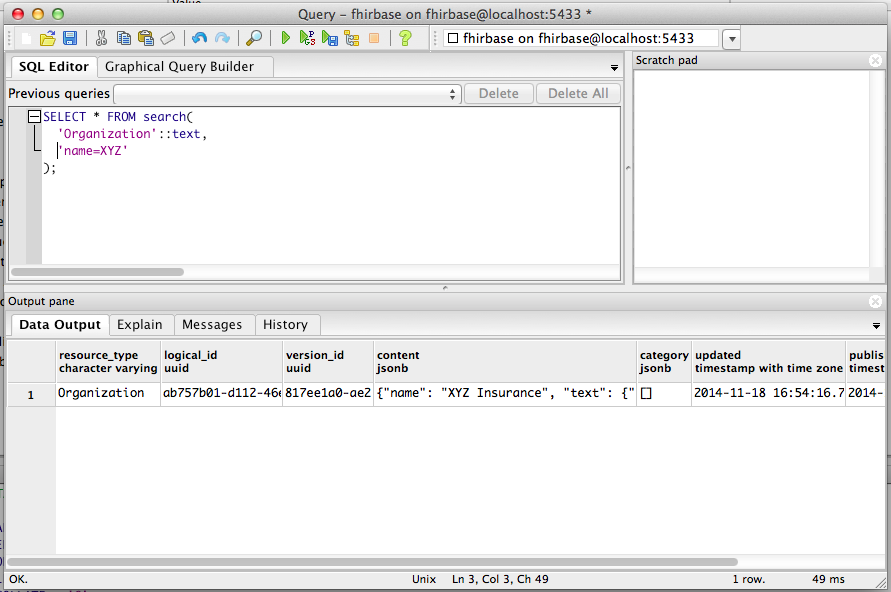

## Installation

FHIRPlace and FHIRBase both are using a lot of third-party software
like PostgreSQL, Java, Node.js, etc. Installing it by hand is an
complex task which can take several working days to accomplish.

Fortunatelly, another approach is available nowadays. Instead of
installing all required software manually, one can use virtualization
technologies to run a "virtual machine" with alredy pre-configured
operating system.

To quickly get FHIRPlace up and running we advice you to follow
virtualization path. If you're willing to install FHIRPlace to your
local machine or server, please follow full
[Installation Manual](https://github.com/fhirbase/fhirplace/wiki/InstallationManual).

## Running FHIRPlace's Virtual Machine

### Mac OS X and Windows

If you're running Windows or Mac OS X, you have to install
[VirtualBox](https://www.virtualbox.org/) virtualization
software. Installation process is quite straightforward, so we don't
describe it here. If problems arise, refer to
[Official Installation Manual](https://www.virtualbox.org/manual/ch02.html).

### Linux

If you're runnig some flavour of Linux, make sure you have Docker installed:

```bash
$ docker --version # or docker.io --version
```

If `docker` binary is not present, install it using your
distributive's package manager, e.g. `sudo apt-get install docker.io`.

### Installing Vagrant

[Vagrant](https://www.vagrantup.com/) is a simple and powerful
command-line utility to manage virtual machines primary intended for
developers use. Navigate to
[downloads page](https://www.vagrantup.com/downloads.html) to get an
installer suitable for your OS. After installation is finished, run
Terminal application (on Mac OS X) or Command Prompt (on Windows) to
test if installation was successful. Type following command:

```bash
vagrant --version
```

If you see output like

```bash
Vagrant 1.6.5
```

you had successfuly installed Vagrant.

### Getting FHIRPlace source code

You have to get FHIRPlace source code to run FHIRPlace. If you have
[Git](http://git-scm.com/) SCM installed, clone FHIRPlace repository
from GitHub. Alternatively, you can download
[ZIP archive](https://github.com/fhirbase/fhirplace/archive/master.zip)
and unpack it somewhere in your file system.

### Starting VMs

Open Terminal (or Command Prompt) and navigate to directory where
FHIRPlace's source code is located, e.g.:

```bash
cd ~/work/fhirplace
```

Then start FHIRPlace VMs with command:

```bash
vagrant up fhirbase && vagrant up fhirplace
```

Initial VMs startup can take a lot of time because Vagrant have to
download several OS images (about 1.5 Gb total) and unpack them. Next
startups will be much faster (almost instant).

If Vagrant won't report any errors, direct your browser to
http://localhost:3000/ and you'll see FHIRPlace welcome page.

### Stopping VMs

When you finish your work with FHIRPlace, you may decide to stop running
VMs to free system resources that they have allocated. This can be done with
following command:

```bash
vagrant halt fhirbase fhirplace
```

## Accessing FHIRBase with pgAdmin

You can access FHIRBase directly using any PostgreSQL client like
command-line `psql` utility or graphical
[pgAdmin](http://www.pgadmin.org/). This section describes connection
to FHIRBase with pgAdmin, actions in other clients are similar.

Run pgAdmin and click <kbd>File -> Add server...</kbd> menu. Enter
following connection paremeters in dialog window:

Parameter | Value
----------|----------
Host      | localhost
Port      | 5433
User      | fhirbase
Password  | fhirbase



Click "OK" and you will see new server appeared in the left sidebar.



Double-click newly created server to connect to it. Then expand
"Databases" subtree and double-click "fhirbase" database.



Now you're connected to `fhirbase` database and ready to perform SQL
queries. Let's try to create new [Organization resource](http://www.hl7.org/implement/standards/fhir/organization.html).

Click <kbd>Tools -> Query tool</kbd> menu and SQL editor window will appear.



Copy-paste following SQL query:

```sql
SELECT fhir_create(
  '{"base":"https://localhost:3000/"}'::jsonb,
  'Organization',
  '{"resourceType":"Organization","text":{"status":"generated","div":"<div>\n      <p>XYZ Insurance</p>\n    </div>"},"identifier":[{"system":"urn:oid:2.16.840.1.113883.3.19.2.3","value":"666666"}],"name":"XYZ Insurance"}'::jsonb,
  '[]'::jsonb
);
```

Press <kbd>F5</kbd> or click <kbd>Query -> Execute</kbd> menu to run
query. You should see result in "Output" pane:



That means query was executed successfuly. Now let's try to find newly
created Organization with FHIR search functionality. Copy-paste
following query in editor window and execute it:

```sql
SELECT * FROM search(
  'Organization'::text,
  'name=XYZ'
);
```

In "Output" pane you'll see Organization resource we inserted in previous step.



Summarizing up, we connected to FHIRBase using pgAdmin and performed
some queries to test if it's actually works. Please, refer to
[FHIRBase](https://github.com/fhirbase/fhirbase) and
[PostgreSQL](http://www.postgresql.org/docs/) Documentation for
further reading.
